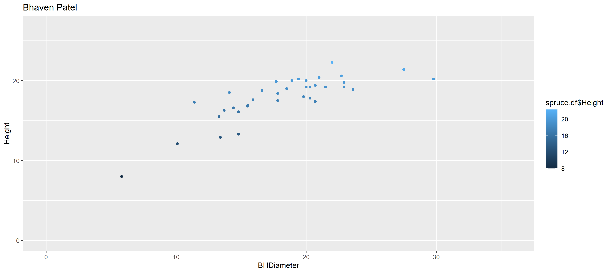
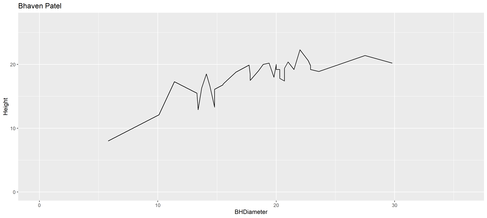
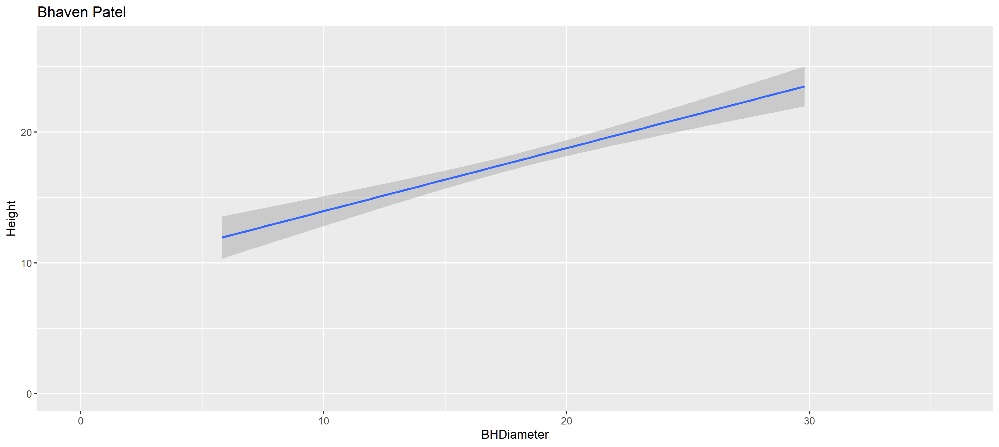
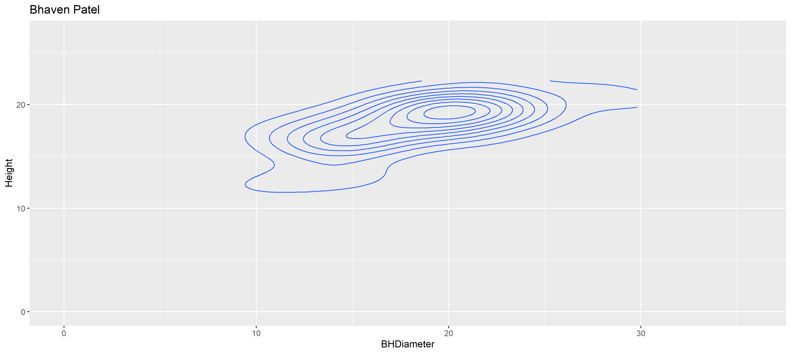

```{r setup, include=FALSE}
knitr::opts_chunk$set(echo = TRUE)
```

# Task 1

WD

```{r}
getwd()
```

# Task 2

```{r}
spruce.df = read.csv("SPRUCE.csv")
head(spruce.df)
```

# Task 3
Create a scatter plot to view the relations between Tree Height and BHDiameter

```{r}
plot(Height~BHDiameter, main="Tree Height and BHDiameter Relation", xlab="Breat Height Diameter (cm)", ylab="Height of Tree (m)", pch=21, bg="blue", cex=1.2, xlim=c(0,max(BHDiameter)*1.1), ylim=c(0,max(Height)*1.1),data=spruce.df)
```

Does there appear to be a straight line relationship?

There appears to be a straight upwards line for the most part. However, a curved line would better fit the relationship.

Trendsscatter plots for f= 0.5, 0.6, 0.7

```{r}
library(s20x)
lo=layout(matrix(1:3, nr=3, nc=1, byrow=TRUE))
tsone=trendscatter(Height~BHDiameter, f=0.5, data=spruce.df)
tstwo=trendscatter(Height~BHDiameter, f=0.6, data=spruce.df)
tsthree=trendscatter(Height~BHDiameter, f=0.7, data=spruce.df)
```

Make linear model
```{r}
spruce.lm = lm(Height~BHDiameter, data = spruce.df)
```

Scatter plot with least squares regression line
```{r}
plot(Height~BHDiameter, data=spruce.df)
abline(spruce.lm)
```

Comments on the graph with straight line relationship:

The straight line fits the graph well, but a curved line would be more appropriate. As we saw from the smoother scatter plots above that a slightly curved line would be best-fit for the graph.

# Task 4
Divide the graphical interface into 4 equal areas, use layout.show(4) and record the picture

```{r}
yhat=with(spruce.df, predict(spruce.lm, data.frame(BHDiameter)))

lo=layout(matrix(1:4, nr=2, nc=2, byrow=TRUE))
layout.show(4)

tsone=plot(Height~BHDiameter, main="Tree Height vs BHDiameter", pch=21, cex=1.2, bg="blue", xlab="Breast Height Diameter (cm)", ylab="Height of Tree (m)", xlim=c(0,max(BHDiameter)*1.1), ylim=c(0,max(Height)*1.1), data=spruce.df)
abline(spruce.lm)

tstwo=plot(Height~BHDiameter, main="RSS", pch=21, cex=1.2, bg="blue", xlab="Breast Height Diameter (cm)", ylab="Height of Tree (m)", xlim=c(0,max(BHDiameter)*1.1), ylim=c(0,max(Height)*1.1), data=spruce.df)
with(spruce.df, {segments(BHDiameter, Height, BHDiameter, yhat)})
abline(spruce.lm)

tsthree=plot(Height~BHDiameter, main="MSS", pch=21, cex=1.2, bg="blue", xlab="Breast Height Diameter (cm)", ylab="Height of Tree (m)", xlim=c(0,max(BHDiameter)*1.1), ylim=c(0,max(Height)*1.1), data=spruce.df)
with(spruce.df, abline(h=mean(Height)))
with(spruce.df, segments(BHDiameter, mean(Height), BHDiameter, yhat, col="Red"))
abline(spruce.lm)

tsfour=plot(Height~BHDiameter, main="TSS", pch=21, cex=1.2, bg="blue", xlab="Breast Height Diameter (cm)", ylab="Height of Tree (m)", xlim=c(0,max(BHDiameter)*1.1), ylim=c(0,max(Height)*1.1), data=spruce.df)
with(spruce.df, abline(h=mean(Height)))
with(spruce.df, segments(BHDiameter, Height, BHDiameter, mean(Height), col="Green"))
```

Calculate TSS, MSS, and RSS
```{r}
#RSS
RSS=with(spruce.df, sum((Height - yhat)^2))
RSS

#MSS
MSS=with(spruce.df, sum((yhat-mean(Height))^2))
MSS

#TSS
TSS=with(spruce.df, sum((Height - mean(Height))^2))
TSS

#Calculate TSS/MSS
TSSMSS = TSS/MSS
TSSMSS

#actual
TSS
#TSS=RSS+MSS
TSS1= RSS+MSS
TSS1
```
Does TSS=RSS+MSS?

yes, TSS=RSS+MSS

# Task 5
summarize spruce.lm
```{r}
summary(spruce.lm)
```

coefficients for spruce.lm
```{r}
coef(spruce.lm)
```

slope value: 0.4814743

intercept value: 9.1468390

equation of the fitted line:
Height = (0.4814743)x + 9.1468390

Predictions:
```{r}
new.diameters = data.frame(newDiameters = c(15, 18, 20))

#Diameter 15cm, 18cm, 20cm
with(spruce.df, predict(spruce.lm, newData = new.diameters))
```

# Task 6
```{r}
library(ggplot2)
gplot <- ggplot(spruce.df, aes(x=BHDiameter, y=Height, color=BHDiameter)) + geom_point()  + geom_smooth(method="lm") + geom_line()
gplot <- gplot + ggtitle("Tree Height vs BHDiameter")
gplot
```


# Me

```{r}
obj = lm(Height~BHDiameter, data = spruce.df)
summary(obj)
plot(Height~BHDiameter, data = spruce.df)
abline(obj)
library(s20x)
trendscatter(Height~BHDiameter,f=0.7, data=spruce.df)
```


# Task 7
This is how you place images in RMD documents

<center>
{ width=80% }
</center>

<center>
{ width=80% }
</center>

<center>
{ width=80% }
</center>

<center>
{ width=80% }
</center>

